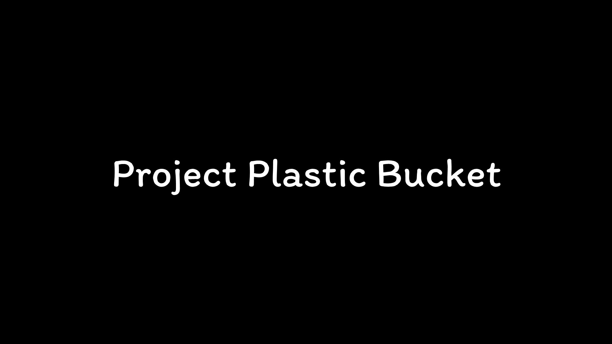

<h1> Project : Plastic Bucket</h1>

<h1>About</h1>
<li>เนื่องจากปัญหาขยะพลาสติกมีมากมาย ตัวอย่าง ขวดพลาสติก กลุ่มของพวกเราจึงอยากรณรงค์ขวดพลาสติกภายในองค์กร และ นำขวดพลาสติกมาต่อยอดเพื่อสร้างรายได้ให้แก่องค์กร ถือเป็นอีกหนึ่งตัวอย่างในการรณรงค์ขยะขวดพลาสติก พวกเราจึงคิดค้น ถังแยกขวดพลาสติกที่แยกเฉพาะขวดพลาสติก โดยการนำ IoT เข้ามาใช้พัฒนาตัวโครงงานควบคู่กับ Could Service</li>
<li>เราจึงมีความคิดในการแยกเก็บขวดพลาสติกโดยเฉพาะเลย เพื่อง่ายต่อการนำไปใช้ประโยชน์ต่อ หรือ นำไปสร้างรายได้เพิ่มได้ในอนาคต</li>
<li>ซึ่งต่างจากตัวถังขยะแบบเดิม โดยที่ว่า Plastic Bucket มีการใช้เทคโนโลยี IoT หรือ Internet of Things เข้ามาเพื่อควบคุมทั้ง Project</li>
<li>สามารถนำไปพัฒนาอนาคตโดย การควบคุมทุก PlasticBucket เพียงแค่เครื่อง Server เครื่องเดียว ควบคุมการเล่น Plastic Bucket โดยมี ID ประจำแต่ละตัว Plastic Bucket ซึ่งในส่วนนี้จะเป็นแผนพัฒนาต่อในอนาคต</li>

<li>โครงงานชิ้นนี้เป็นส่วนหนึ่งของวิชา Problem Solving Information Technology</li>

<h1>Service</h1>
<li>Firebase : <a href="https://firebase.google.com/">https://firebase.google.com/</a></li>
<li>Bootstrap : <a href="https://getbootstrap.com/">https://getbootstrap.com/</a></li>
<li>Google Font : <a href="https://fonts.google.com/">https://fonts.google.com/</a></li>
<li>WorldTimeAPI : <a href="http://worldtimeapi.org/">http://worldtimeapi.org/</a></li>

<h1>Built With</h1>
<li>C++ language</li>
<li>php language</li>

<h1>วิธีการ</h1>
<li>มีการใช้ php ในการเขียนเว็บดึง API ของ Firebase เพื่อนำมาแสดงผล และ Check ค่าเพื่อเล่น plasticvoice.mp3 ซึ่งเป็นเสียงที่ทำการบันทึกมาจาก Google Translate</li>
<li>มีการส่งค่าจาก Sensor ที่ติดตั้งอยู่กับตัวถัง จะมีการส่งค่าขึ้นไปเก็บบน Firebase โดยการเขียนโค้ด ที่อยู่ใน PlasticBucket_Controller</li>

<h1>Video Presentation</h1>

<h1>อุปกรณ์ (จำเป็นต้องมีก่อนไปขั้นตอนการใช้งาน)</h1>
<li>Breadboard 1 ชิ้น</li>
<li>Laser Head Transmitter Sensor Module 1 ชิ้น</li>
<li>Photoresistor Light Sensor Module 1 ชิ้น</li>
<li>สายจั้ม (ใช้ได้ทั้งหมดไม่ว่าจะเป็น ผู้-ผู้, ผู้-เมีย, เมีย-เมีย) >= 6 สาย</li>
<li>กล่องพลาสติก หรือ ถังพลาสติก 1 กล่อง/ถัง</li>

<h1>การใช้งาน</h1>
<li>ติดตั้ง Laser Head Transmitter Sensor Module กับ Photoresistor Light Sensor Module วางไว้ขนานกัน และ เชื่อม NodeMCU ESP8266 กับ Breadboard วางไว้ด้านบนของ Plastic Bucket</li>
<li>จำเป็นต้องลง ArduinoJson และ FirebaseArduino ก่อน และ ติดตั้ง Web Server และนำ Index.php ขึ้นไปไว้บน Web Server ก็ใช้งานได้ทันที</li>
<li>FirebaseArduino : <a href="https://github.com/FirebaseExtended/firebase-arduino">https://github.com/FirebaseExtended/firebase-arduino</a></li>
<li>ArduinoJson : <a href="https://github.com/bblanchon/ArduinoJson">https://github.com/bblanchon/ArduinoJson</a></li>

<h1>Member</h1>
<li>นาย ศิรวิทย์ ยอดจิตร 61070221</li>
<li>นางสาว ปิยาภรณ์ แสงจ้า 62070123</li>
<li>นาย ภูผา ผูกพานิช 62070150</li>
<li>นาย สิรวิชญ์ น้อยคำมูล 62070200</li>
<li>นาย นาย อภิรัชต์ ผะสมเพชร 62070217</li>

